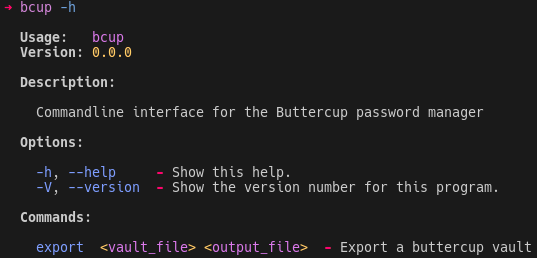

# Buttercup CLI ( Eventually )

This may eventually become a dependency-less buttercup CLI, but for now is primarily just to give me a way to programmatically access my buttercup vaults with [Deno](https://deno.land) instead of Node.js.

This is 100% unofficial.

## Compiling

You can compile the CLI to a standalone executable by running the script `./compile.sh`.

## Usage

